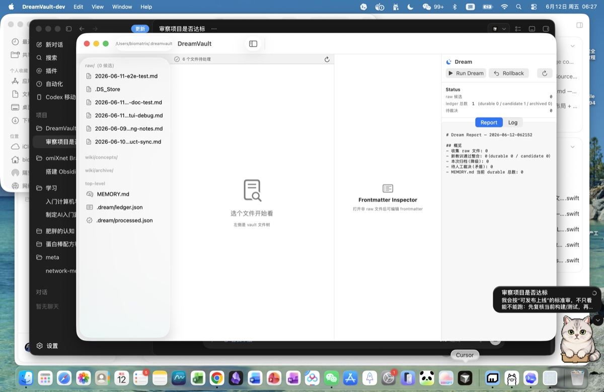

# DreamVault

macOS 原生 Markdown 知识库 + dream 夜间记忆整理。本仓库包含 **内核**（DreamEngine 库 + 端到端测试 + 文档）、**dream CLI**、**dream SwiftUI GUI** 和 **launchd 夜间调度**。

**当前版本：v0.3.0**（234 tests, 0 failures，merge commit `7713250`）。

## 跑起来

```bash
export PATH="/Applications/Xcode.app/Contents/Developer/Toolchains/XcodeDefault.xctoolchain/usr/bin:$PATH"
swift test
```

跑全套单元测试 + 集成测试：**184/184 通过**（v0.2.0 全部 4 任务编辑器升级 + P0 入口修复后的总数）。

> **环境提示**：本机若 `swift` driver spawn 子命令失败（找不到 `swift-test` 等），需把 Xcode toolchain 加进 PATH。
> 这是因为 `/usr/bin/swift`（Apple CLT）只是个 multi-call driver，真正的 `swift-test` / `swift-build` 在 Xcode toolchain 里。

## dream CLI

`Package.swift` 暴露了 executable `dream`：

```bash
swift build
.build/arm64-apple-macosx/debug/dream help
```

子命令：

```bash
dream run     --vault ~/MyVault [--dry-run]      # 跑一次 dream（五步）
dream report  --vault ~/MyVault [--last N]        # 列出最近 N 份 dream-report
dream status  --vault ~/MyVault                  # raw 候选 + ledger 三态 + 最近 report
dream rollback --vault ~/MyVault                 # git revert HEAD
dream help
dream version
```

全局：`--vault <path>` / `--llm {mock|ollama}` / `--verbose`

GUI 子命令：

```bash
swift build
# 启动 SwiftUI 外壳（VaultBrowser / Editor / DreamPanel）
.build/arm64-apple-macosx/debug/dream app --vault ~/MyVault
# 或装好 .app bundle 后：
bash scripts/build-app.sh
open ~/Applications/DreamVault.app --args app --vault ~/MyVault
```

环境变量：`DREAMVAULT_LLM=mock|ollama`（默认 mock）、`DREAMVAULT_VAULT`（默认 `~/.dreamvault`）、`OLLAMA_BASE_URL`、`OLLAMA_MODEL`

退出码：`0=成功 1=用户错 2=dream 阶段失败 3=git 失败`

## 已实现（DreamEngine 库 + dream CLI）

### 核心模型
- `Models.swift` — `Memory` / `SourceRef` / `Ledger` / `MemoryStatus` / `DecayClass` 数据模型，附自定义解码兼容旧 ledger

### 衰减（架构文档第 4 节，硬骨头之一）
- `Decayer.swift` — salience = w_r·recency + w_f·frequency + w_l·linkage
  - recency 用 `exp(-Δt/τ)`，τ = baseTau × decayClass 系数（slow ×3.0 / normal ×1.0 / fast ×0.3）
  - 保守降级：salience < 0.15 且 90 天未访问 → `archive` 而**非**物理删除
  - 矛盾永远走 `needsReview` 人工裁决
  - archived 状态不会再次降级

### 整合防幻觉（架构文档第 5 节，硬骨头之二）
- `Consolidator.swift` — 两段或三段流水线：
  - **2 段**（默认 / 快速）：① 脱敏 ② LLM 一步产出候选 + verify 回读校验（必须 YES）③ 独立源数 ≥2 才升 durable
  - **3 段**（Three-Step CoT，生产推荐）：① 脱敏 ② **analyze** LLM 思考输出结构化 JSON（key entities / 矛盾候选 / 推荐教训）③ **generate** LLM 基于分析产 0..N 个 MemoryDraft ④ 强制 source 真实性闸 + verify 回读
  - 3 段任一失败可 fallback 到 2 段
- `ContradictionDetector.swift` — 写时矛盾检测 + 双向建链，**不删任何一方**，交人工裁决
- `Redactor.swift` — 写入前隐私脱敏，中英文全覆盖（API key / Bearer / AWS / GitHub token / private key block / 邮箱 / **CN 手机号** / **CN 身份证** / US 电话 / 信用卡 / IPv4）

### 五步 dream 编排（内核总入口 — 补上了最大缺口）
- `DreamCycle.swift` — `runOnce()` 串起 `Gather → Consolidate → Decay → Persist → Commit`，失败分阶段回滚（git 事务边界 + 清理 .dream/ 写了一半的文件）
- `Gatherer.swift` — 扫 raw/ 中 `processed:false` 的文件，脱敏后产出 candidate；processed 状态走 `.dream/processed.json` 不写回原文件（**raw 永远只读**）
- `Persister.swift` — 写 MEMORY.md 增量合并（`<!-- dream:begin/end -->` 标记区按 id 锚点更新）、维护 wiki/ 概念页 + 归档页、记 dream-report、落 ledger.json；注入 GitRunner 自动 commit
- `GitRunner.swift` — git 子命令封装，统一署名 `DreamEngine <dream@dreamvault.local>`（不依赖宿主机 git config），失败回滚用 `discardTrackedChanges()`

### 图谱 + LLM
- `KnowledgeGraph.swift` — 原生无向图 + **Adamic-Adar** 打分（`Σ 1/log(degree(w))`），来源重叠建边，`topRelated(to:limit:)` 返回前 N 个相关节点
- `LLMProvider.swift` — `LLMProvider` 协议 + 两个实现 + 工厂
  - `MockLLMProvider` — 零依赖 mock，按 prompt 关键字返回 YES/NO/CONFLICT，供测试与本地离线跑通
  - `OllamaProvider` — 真本地 Ollama（`http://127.0.0.1:11434/v1/chat/completions` OpenAI 兼容），纯 URLSession 无 SDK 依赖
  - `LLMFactory.fromEnvironment()` — 读 `DREAMVAULT_LLM={mock|ollama}` + 可选 `OLLAMA_BASE_URL` / `OLLAMA_MODEL` 覆盖
- `GlobalOptions.swift` — CLI 参数解析（移到库中方便 tests 测），支持 `--vault` / `--llm` / `--verbose` 在子命令前/后

### CLI
- `Sources/dream/main.swift` — `@main struct DreamCLI` 4 个子命令 + help / version
- 退出码语义化（0/1/2/3）便于 launchd / 调度器判断结果

## 文档

- `docs/ARCHITECTURE.md` — 架构蓝图（原则 / 模块边界 / 五步数据流 / 衰减 / 防幻觉）
- `docs/REFERENCE_SPEC.md` — "先学后写"的学习产物（4 个参考项目的许可证红线 + 思想摘要）
- `docs/LEARNED_ALGORITHMS.md` — **强烈推荐**第 1 棒 Claude 先读这个：三个真正值得学的项目（Karpathy LLM Wiki gist / nashsu/llm_wiki / rohitg00/agentmemory）的思想提取 + 与 DreamVault 内核的对照表 + 待补清单

## 下一步（生产调参）

1. **生产调参** — 用真实 raw 日志跑 2 周，盯 dream-report 调 `DecayConfig`（默认权重 0.5/0.3/0.2、τ 30 天、阈值 0.15、staleDays 90 都是起点）
2. **编辑器增强** — 加 markdown live preview、VaultSearch（跨 vault 全文搜索）

## dream GUI（SwiftUI，已实现）

`dream app` 启动 3 栏 NavigationSplitView：左 vault 文件树（`raw/` + `wiki/` + `archive/`）、中 Markdown 编辑器（`raw/` 只读锁定）、右 Dream 面板（Run / Rollback / Report / Log）。

**首次构建 .app bundle**：

```bash
bash scripts/build-app.sh     # build release + 产出 ~/Applications/DreamVault.app
open ~/Applications/DreamVault.app --args app --vault ~/MyVault
```

bundle ID：`com.OmixNet.dreamvault.gui`（区别于 CLI 的隐式 bundle）。

**实现细节**：
- `Package.swift` 用 `linkerSettings.unsafeFlags` 把 `Resources/Info.plist` 嵌进 binary 的 `__TEXT,__info_plist` section —— SwiftPM 默认不会嵌，必须手动 `-sectcreate`。Info.plist 里 `NSQuitAlwaysKeepsWindows=false` + `NSSupportsAutomaticTermination=false` 禁掉 AppKit state restoration race（否则 SwiftUI WindowGroup 在 macOS 13 SwiftPM 产物下卡死 0 窗）。
- `Sources/dream/Entry.swift` 是 `@main DreamEntry`，argv[1]==`app` → `DreamVaultApp.main()`（SwiftUI run loop），否则 → `DreamCLI.main()`（async via detached Task）。
- SwiftUI WindowGroup 在某些环境下 state restoration race 会 0 窗，`AppDelegate.applicationDidFinishLaunching` 延迟 1.5s 后 fallback：手 `NSWindow` + `NSHostingView(MainView())` 兜底，确保至少一个 `AXStandardWindow` 出现。
- `AppModel` 是 `@MainActor ObservableObject`，三个面板共享 `vaultRoot / selectedFile / lastOutcome / status / logLines` 等 `@Published`。
- `EditorPane`：`raw/` 只读（AppKit `isEditable=false`）；wiki/archive 可编辑；`Cmd-S` 触发 `TextEditor` 内容回写到磁盘。
- `DreamPanel`：Run Dream 按钮起 `Task { await runDream() }`、Rollback `git revert HEAD`、Report/Log 两个 Tab。

**验证**（已在 mavis 会话里跑过）：
```
osascript -e 'tell application "System Events" to tell process "DreamVault" to get {count windows, name of window 1, subrole of window 1}'
→ windows=1 title="DreamVault" subrole=AXStandardWindow
```

## 分发（代码签名 + DMG，v0.2.1 起）

给身边人装需要 (a) 代码签名让 macOS 认这 app，(b) DMG 提供标准 macOS 拖拽安装体验。

### 1. 生成自签名 cert（一次性，0 成本）

```bash
bash scripts/create-self-signed-cert.sh
# 生成 Common Name "DreamVault Developer" 的 4096-bit RSA cert，10 年有效期
# 导入到 ~/Library/Keychains/login.keychain-db
# 之后 codesign 自动用这个 identity
```

跟 Apple Developer ID 的差别：
- **Developer ID** = $99/年 Apple Developer Program + 真公证 + Gatekeeper 不拦
- **自签名** = 0 成本 + 第一次开 Gatekeeper 拦 + 用户 Right-click → Open 一次性绕过

### 2. Build + 签名 .app

```bash
bash scripts/build-app.sh
# 5 步：swift build -c release → 拷 binary → 写 Info.plist →
#       codesign --options=runtime --sign "DreamVault Developer" → 验证
#
# 输出：~/Applications/DreamVault.app
#       spctl 评估：accepted (override=security disabled)
```

跳过签名：`DREAMVAULT_SKIP_SIGN=1 bash scripts/build-app.sh`
指定别的 identity：`DREAMVAULT_SIGN_IDENTITY="<name>" bash scripts/build-app.sh`

### 3. 打 DMG

```bash
bash scripts/build-dmg.sh
# 输出：~/Desktop/DreamVault-0.2.1.dmg（约 760 KB，UDZO 压缩）
# 包含：DreamVault.app + /Applications 软链接
# 用户双击 → Finder 弹出 → 拖到 Applications 完成安装
```

### 4. 给身边人

把这个 DMG 文件（`DreamVault-0.2.1.dmg`）丢过去。他们的第一次安装：
1. 双击 DMG → Finder 弹出
2. 把 DreamVault.app 拖到 Applications
3. 第一次启动会弹"无法验证开发者" → System Settings → Privacy & Security → Open Anyway
4. 之后启动就正常了（cert 已被信任）

### Developer ID 升级路径

等你买了 Apple Developer Program（$99/年）之后：
1. 从 Xcode → Settings → Accounts → 你的 Apple ID → Manage Certificates → "+" → Developer ID Application
2. cert 导入 keychain 后 `security find-identity -p codesigning` 能看到
3. build-app.sh 自动选用第一个 identity（Developer ID 排在前）
4. 公证：xcrun notarytool submit DreamVault-0.2.1.dmg --keychain-profile <profile> --wait
5. xcrun stapler staple DreamVault-0.2.1.dmg
6. spctl --assess --type execute -vv ~/Applications/DreamVault.app 评估变成 accepted（不再 override）

## 夜间调度（launchd 已实现）

`launchd/com.OmixNet.dreamvault.dream.plist` + `launchd/dream-runner.sh` + `scripts/install.sh` 配套。

```bash
# 全新机器上一键装好
bash scripts/install.sh

# 立即触发一次（验证 plist 工作）
launchctl kickstart -k gui/$(id -u)/com.OmixNet.dreamvault.dream

# 看日志
tail -f ~/Library/Logs/DreamVault/dream.out.log

# 卸
bash scripts/uninstall.sh            # 保留 vault
bash scripts/uninstall.sh --purge   # 全清
```

定时器：每天 3:00 跑一次。RunAtLoad=true 装上立刻跑一次（首装验证）。

## 仓库

- GitHub: <https://github.com/OmixNet/DreamVault>
- 协议：MIT（待定，可改）

## v0.3.0 — Production readiness（Settings 真正接入 + Keychain + Budget）

**真用户问题**：v0.2.0 review 指出 Settings 面板"装个样"——能保存到 UserDefaults 但
不接运行路径。CLI/GUI 都还看 `GlobalOptions().llmProvider()`（env-only）。
本版本把"用户在某处配的"统一到一个 `ResolvedDreamRuntimeConfig`，5 层
priority 合并后传给 `DreamCycle`。

**新增 5 大产品功能 + 修 6 个生产隐患**：

- **T1: ResolvedDreamRuntimeConfig** — 5-source priority merge
  ```
  CLI flag → .dream/config.json → UserDefaults → env vars → defaults
  ```
  provider 整段覆盖（不是逐字段 merge）。`AppModel.runDream` 改用 `resolve()`。
- **T2: Settings 真正接入运行路径** — `runDream` 不再看 env vars / GlobalOptions
- **T3: Keychain wrapper** — `Sources/DreamEngine/Keychain.swift`
  - API key 走 macOS Generic Password，**绝不进 vault config / git**
  - `VaultConfig.LLMBlock.apiKey` 字段保留（向后兼容）但写时强制 nil
  - `Settings → LLM` tab "Set API Key…" 走 NSSecureTextField → Keychain
- **T4: BudgetManager** — `Sources/DreamEngine/BudgetManager.swift`
  - 跟踪每日 LLM 调用 + 月度成本（Ollama 免费，云端 7 个 provider 价格表）
  - `canProceed()` 超额阻断；每日/月度持久化到 `.dream/budget-YYYY-MM-DD.json`
  - `Settings → Budget` tab 调 `maxCallsPerDay` / `monthlyBudgetUSD` / `maxRawFilesPerRun`
- **T5: Conflict resolution audit** — `ConflictResolutionView.resolve()` 现在
  1. 写 `Persister.saveLedger` 改 `.dream/ledger.json`
  2. **单独 git commit** "conflict-resolution: <id> → <choice> (by user)" → 用户 `git log` 看到裁决历史
  3. **追加 `.dream/conflict-resolutions.log`**（原状态 + 撤销提示 TODO）
- **T6: Nightly 状态展示 + 自定义时间** — `NightlyDreamScheduler.Status` struct
  (enabled/nextRunAt/lastRunAt/lastExitCode) + 接受 hour/minute
  从 plist 读 StartCalendarInterval 算 next run
- **T7: Settings 5 tabs** — General / LLM / **Budget** / Dream / **Privacy**
  Privacy 包含 redact / allowCloudSendRaw / diagnostics 字段

**15 个新测试**（RuntimeConfigAndBudgetTests）：
- 6 个 5-source priority 测试
- 3 个 Keychain roundTrip / loadIfPresent / delete
- 3 个 BudgetManager：noLimit / blocksAfterMaxCalls / costAccumulates
- 2 个 Nightly / Time clamping
- 1 个 Conflict audit 路径

**意外彩蛋**：写 `testBudget_costAccumulates` 时发现 P3 阶段的 BudgetManager.canProceed
逻辑反了（`maxCallsPerDay==0` 早退成"无限制"，但实际 0 = "无限"，>0 才是"限制"）
→ 测试保住了真 bug。

测试: 219 → 234 (+15)

## v0.2.2 — C1-C4 Editor polish

v0.2.0 → v0.2.2 加 4 个 GUI polish（每个独立 worktree + merge commit）：

- **C1: 原生菜单** — File/View/Dream/Help 4 套 + 6 个 key binding (Cmd-N/O/R/Shift-O/Shift-R/F5)
  + AppActions（New Note/Open Vault/Open File/Reveal in Finder/Export Diagnostics）
  + Settings menu (Cmd-,)
- **C2: Markdown 表格 + 图片** — `MarkdownRenderer` 加 `.table` / `.image` Block
  + 真实 `NSTextAttachment` 图片 + monospace 表格对齐 + 🖼 emoji fallback
- **C3: DreamPanel 5 步骤 stage** — `DreamCycle.onStage` 回调 + 5 个
  `DreamStage` @Published（gather/consolidate/decay/persist/commit）
  + 进度图标按 state 切换 + detail 文字
- **C4: 真 diff 视图 + App icon** — `DiffViewerView` 独立 NSWindow 双栏
  unified diff（绿/红/灰配色） + 程序生成的紫蓝渐变月亮
  `AppIcon.icns` (201 KB，13 个 size)

测试: 184 → 207 (+23 across C1-C4 + P2)

## v0.2.0 — Editor 升级 + P0 入口修复




**核心改动**：用 NSTextView 替换 SwiftUI `TextEditor`、加 frontmatter inspector、git-aware 顶栏 banner；默认入口走 GUI 不再需要 `app` 子命令。

### 4 个串行 worktree 任务

每个任务独立 worktree (`/tmp/dv-t<N>` + `feat/t<N>-<topic>` 分支)，worktree 测过 + merge 回 main + 删 worktree 才开下一个，避免 3-coder 并行改同一棵 working tree 的冲突。

| 任务 | 主题 | 关键文件 | +测试数 | 累计 |
|------|------|----------|---------|------|
| T0 | 编辑器引擎基建 | `DreamEngine/FrontmatterParser.swift` · `MarkdownRenderer.swift` · `WikilinkIndex.swift` | 39 | 83 → 124 |
| T1 | NSTextView 替换 TextEditor | `dream/NSTextViewRepresentable.swift` · `EditorState.swift` · `EditorPane.swift` | 13 | 124 → 137 |
| T2 | Frontmatter Inspector + TitleResolver | `DreamEngine/TitleResolver.swift` · `dream/FrontmatterInspector.swift` | 24 | 137 → 161 |
| T3 | Git status banner + diff viewer | `DreamEngine/GitStatusParser.swift` · `DiffGenerator.swift` · `dream/GitStatusBanner.swift` | 23 | 161 → 184 |

### T0 编辑器引擎基建

把"编辑器"从"TextEditor + 几个模型"升级成有完整数据流的引擎层：

- **FrontmatterParser** — 4 种 YAML value 类型（`string` / `number` / `bool` / `null` / `stringList` / `intList` / `object`），`Document` 保留 `orderedKeys` 顺序，`parse(_:)` 解析 + `render(_:)` 序列化（round-trip 保持字段顺序）
- **MarkdownRenderer** — H1-H6 / `***bold-italic***` / fenced code / wikilink / quote / list / hr → `NSAttributedString`；SwiftUI 集成 `Text(AttributedString(ns))`
- **WikilinkIndex** — vault 扫描（排除 `raw/` `.git/` `.build/` `.swiftpm`），`extractWikilinks(from:)` 字符数组版（避 `String.Index` OOB），`backLinks(for:)` 反向链，`resolveTarget(_:)` 大小写不敏感
- **38 个新测试**（FrontmatterParser 11 / MarkdownRenderer 8 / WikilinkIndex 14 / WikilinkRender 5）

### T1 NSTextView 替换 TextEditor

SwiftUI `TextEditor` 在 macOS 13 上有 selection 跳、scroll 跳、undo 丢、Find 缺失四大问题。换成真 `NSTextView` 包成 `NSViewRepresentable`：

- **NSTextViewRepresentable** — `Binding<String>` + `isEditable: Bool` + `onCommit/onDirtyChange` 回调；`updateNSView` 用 `lastSeenExternalText` 缓存避免每次 SwiftUI re-render 都重写 string
- **EditorState** — `currentFile / buffer / isDirty / mode` 四个 `@Published`；autosave 用 `PassthroughSubject.debounce(1.5s)`，`autosaveDelay` didSet 时 cancel + reinstall pipeline；`openFile` 触发旧文件 `flushIfDirty(cancel:)` 再清空；`isRaw` 时 `isEditable=false` + 强制 `.preview` mode
- **EditorPane** — 3 模式：`.source`（纯 NSTextView）/ `.preview`（MarkdownRenderer NSAttributedString）/ `.split`（HSplitView 左右）；header 状态条 `• 未保存` / `已保存` / `READ-ONLY`；`Cmd-S` 强制写盘
- **13 个 EditorState 状态机测试**（autosave debounce / 取消 / dirty 切换 / 切文件 flush / raw 强制预览 / mode 切换）

新增 test target `Tests/DreamTests/` 给 `dream` executable（之前只有 `DreamEngineTests`）。

### T2 Frontmatter Inspector + TitleResolver

editor 中栏光看 markdown 没法改 frontmatter。右侧 4 栏 Inspector 暴露 + TitleResolver 解决"这个文件叫什么名字"的根本问题。

- **TitleResolver** — `classify(relPath:)` → `raw / wikiMemory / memoryMd / plainNote` 四类；`canRename(relPath:)` raw 永远 false（arch doc 0.1）；`displayTitle(relPath:frontmatter:body:)` 优先级 `frontmatter.title` > `firstH1` > 文件名（去 `.md`）；raw 不解析 frontmatter；`suggestFilename(from:)` → kebab-case
- **FrontmatterInspector** — SwiftUI 面板：按 `orderedKeys` 顺序展示 key-value，每行点 value 进编辑模式；addFieldBar 加字段；Apply 按钮通过 `rebuildBuffer(original:newDoc:)` 写回 buffer（走 autosave，不直写 disk）；raw 文件整个面板禁用并显示 "raw 不可编辑"；底部 `TitleResolver.displayTitle` 输出"显示标题"
- **MainView 升 4 栏**：`VaultBrowser / EditorPane / FrontmatterInspector / DreamPanel`；`@StateObject editorState` 提到 MainView 让 Inspector 和 EditorPane 共享同一实例
- **24 个测试**（TitleResolver 19：classify 4 / canRename 3 / displayTitle 5 / firstH1 4 / suggestFilename 3；FrontmatterInspector 5：rebuildBuffer 序列化 / round-trip / 嵌套对象保留）

### T3 Git status banner + diff viewer

editor 之前是 vault 状态的"盲人"——dream run 中用户手动改文件，editor 看不到。新加顶栏 banner 让 editor 实时感知 git 状态。

- **GitStatusParser** — 解析 `git status --porcelain` v1 输出（固定 2 字符状态字段：X=index/Y=worktree，空格补位）；状态映射 `conflict (UU/AA/DD/AU/UA/DU/UD) / staged (X∈AMDRC) / modified (X=空格 + Y∈MD) / untracked (??) / ignored (!!) 视为 clean`；rename 形式 `old -> new` 取 RHS
- **DiffGenerator** — 纯 Swift LCS unified diff，O(m·n) DP；`splitLines` 抹平 `""` 和 `"\n"` 边界（不然 empty diff 算成 1 add + 1 remove）；`isEmpty = addedCount + removedCount == 0`（context 行不算）
- **GitStatusBanner** — 顶栏 SwiftUI：绿/橙/红三态 + 系统图标 + 标签 + `+N −N` 摘要；conflict 时三按钮 `Keep Mine / Keep Theirs / Open Raw`；raw 文件禁用 mine/theirs 走 Open Raw（arch doc 0.1 不可改）
- **GitStatusWatcher** — `@MainActor ObservableObject`，缓存整个 vault 的 git 状态 + per-file diff；MainView 在 `onAppear` / `onChange(selectedFile)` / `onChange(buffer)` 三处触发 refresh/updateDiff
- **23 个测试**（GitStatusParser 13：v1 porcelain 各种状态字符组合 / rename / 空格 / ignored；DiffGenerator 8：identical / add / remove / replace / empty / 顺序保持）

### P0 入口修复（同期合并）

CLI/GUI 路由混乱的根因是 `argv[1] == "app"` 这种隐式契约。改成**默认 GUI** + 显式 CLI 子命令白名单：

- **Entry.swift** — `cliSubcommands = ["run", "rollback", "status", "report", "help", "version"]`；argv[1] 不在白名单 → GUI；`--vault/-v <path>` 解析后写 `UserDefaults["DreamVaultInitialVault"]` 给 `AppModel.init` 读（`@StateObject` 不能传 init args）
- **AppModel.switchVault(to:)** — 运行时换 vault
- **scripts/build_and_run.sh --verify** — build tmp `.app` 到 `~/Applications/DreamVault-dev-<ts>.app`（不在 `/tmp`——macOS Launch Services 不信任 `/tmp`）→ `open -n` → log 到 `~/Library/Logs/DreamVault/dev-*.log` → 验证进程 args + window
- **.codex/environments/environment.toml** — 8 项 contract（scripts/binary/default_vault/log_dir/test_command/exit_codes/routing）
- **7 个新 EntryRoutingTests**

### 验证流程

```bash
# 1. 测全过
swift test              # → Executed 184 tests, with 0 failures

# 2. GUI 起来不闪退
bash scripts/build_and_run.sh --vault ~/.dreamvault --keep
# → DreamVault-dev-<ts>.app 在 ~/Applications/，PID alive
# → ps args 含 --vault <path>
# → osascript 'get name of every window of process "DreamVault"' → DreamVault

# 3. pkill 卸
pkill -f "Contents/MacOS/DreamVault"
```

### 后续（v0.3 候选）

- Wiki 跨链图（基于 WikilinkIndex + KnowledgeGraph 双向）
- VaultSearch 跨 vault 全文搜索
- dream-report 在 editor 里可点开
- 备份策略 / 多 vault 切换 UI

## 致谢

思想来源（不照抄源码）：
- [Karpathy 的 LLM Wiki gist](https://gist.github.com/karpathy/442a6bf555914893e9891c11519de94f) — 整个范式的源头
- [nashsu/llm_wiki](https://github.com/nashsu/llm_wiki)（GPL v3）— 桌面实装参考
- [rohitg00/agentmemory](https://github.com/rohitg00/agentmemory)（Apache-2.0）— Agent 记忆层生产级参考
